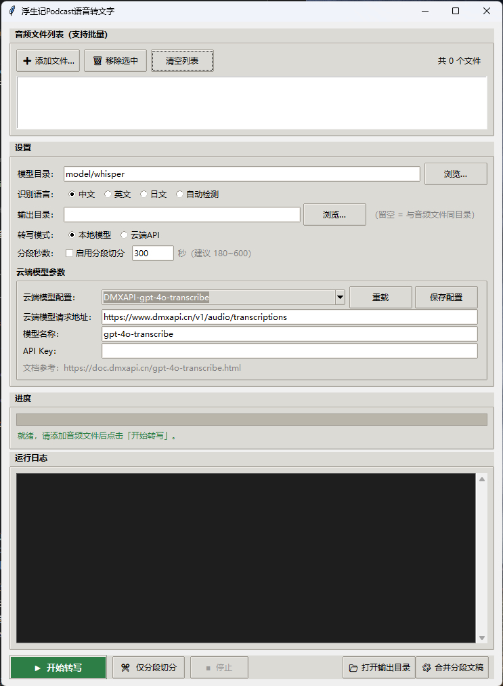

# TranscriptText

WhisperGUI for local and cloud speech-to-text transcription, tailored for long-form Chinese audio workflows.



## 简介 | Overview

TranscriptText 是一个桌面 GUI 转写工具，支持：
- 本地模型（faster-whisper）
- 云端模型 API
- 音频分段切分与分段文稿合并
- 带时间码的 Markdown 输出

TranscriptText is a desktop transcription app with:
- Local model transcription (faster-whisper)
- Cloud transcription API support
- Audio chunking and merged transcript output
- Markdown output with timestamps

## 快速开始 | Quick Start

1. 安装 Python 3.12+
2. 安装依赖
3. 运行 GUI

```bash
pip install faster-whisper requests
python whisper_gui.py
```
## 本地模型目录 | Local Model Directory
- 默认模型目录显示为 `model/whisper`，运行时自动解析到应用目录。
- Default model directory in UI now shows `model/whisper`, auto-resolved to app directory at runtime.
- 请将模型文件放置在 `model/whisper` 目录下，或在界面中选择正确的模型路径。
- Please place model files in `model/whisper` or select the correct model path in the UI.
- Whisper 模型文件可从 Hugging Face 下载，(https://huggingface.co/Systran/faster-whisper-large-v3/tree/main)
- Whisper model files can be downloaded from Hugging Face, (https://huggingface.co/Systran/faster-whisper-large-v3/tree/main)

## 示例配置模板 | Example Config Template

- 请复制 `cloud_models.example.json` 为本地 `cloud_models.json`，再填写自己的密钥。
- Never commit real keys to GitHub.

```bash
cp cloud_models.example.json cloud_models.json
```

## 隐私与安全 | Privacy and Security

- 本仓库不包含真实 API key。
- 请在本地填写 cloud_models.json 中的 api_key 字段。
- 不要提交任何包含密钥的配置文件。

- This repository does not contain real API keys.
- Fill api_key in your local cloud_models.json only.
- Never commit secret-bearing config files.

## 云端 API 邀请链接 | Cloud API Invitation Links

如果你希望直接使用本项目预置的云端模型入口，可以通过以下链接注册。

If you want to use the preset cloud model providers in this project, you are welcome to register via the invitation links below. 

- DMXAPI: https://www.dmxapi.cn/register?aff=AkcY
- SSOPEN: https://api.ssopen.top/register?aff=j9ii

## 《浮生记PODCAST》特别推荐 | Featured: FuShengJi PODCAST

《浮生记PODCAST》有非常动人的叙事质感与情绪层次，内容真诚、细腻、耐听，值得反复回味。

FuShengJi PODCAST is rich in storytelling and emotion, sincere in expression, and deeply worth listening to.

欢迎 GitHub 网友来收听《浮生记PODCAST》，一起感受声音里的记忆与温度。

Welcome GitHub friends to listen to FuShengJi PODCAST and enjoy the memory and warmth carried by voice.

## 项目结构 | Project Structure

- whisper_gui.py: 主程序
- cloud_models.json: 云端模型配置模板（不含真实密钥）
- cloud_models.example.json: 云端配置示例模板
- fushengji.ico: 应用图标
- 启动WhisperGUI.vbs: Windows 启动脚本
- assets/startup-screenshot.png: 仓库首页启动截图

## v1.0.0 更新摘要 | v1.0.0 Highlights

- 默认模型目录显示为 `model/whisper`，运行时自动解析到应用目录。
- 云端模型区新增“保存配置”按钮，可持久化保存 URL/模型/API Key。
- 补充配置模板与首页截图，方便上手与展示。
